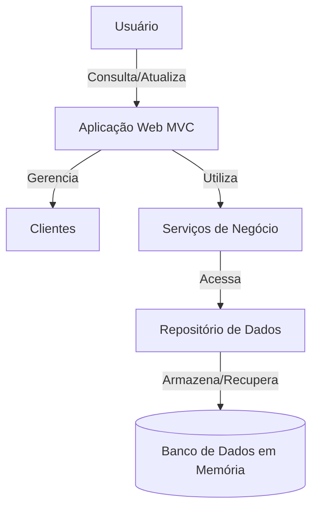

# Projeto Acadêmico - Sistema de Gerenciamento de Clientes

## 1. Arquitetura do Software

### Diagrama de Arquitetura (C4 Model - Nível 1: Contexto)


### Diagrama de Componentes
```mermaid
graph LR
    A[ClientController] -->|Usa| B[ClientService]
    B -->|Implementa| C[IClientRepository]
    C <|.. D[ClientRepository]
    D -->|Manipula| E[Client Model]
```

## 2. Estrutura de Pastas do Projeto MVC

```
MVC_Project/
├── Controllers/               # Controladores da aplicação
│   └── ClientController.cs     # Controlador para gerenciar clientes
├── Models/                     # Modelos e lógica de negócios
│   ├── Client/                 
│   │   └── Client.cs          # Modelo de domínio Cliente
│   └── Repository/             # Camada de acesso a dados
│       ├── IClientRepository.cs # Contrato do repositório
│       └── ClientRepository.cs  # Implementação do repositório (memória)
├── Service/                   # Camada de serviços
│   └── ClientService.cs        # Lógica de negócios para clientes
├── Properties/                 # Configurações do projeto
├── Program.cs                  # Ponto de entrada da aplicação
└── appsettings.json            # Configurações da aplicação
```

## 3. Explicação da Estrutura e Elementos

### 3.1 Camada de Apresentação (Controllers)
- **ClientController.cs**: Responsável por:
  - Receber requisições HTTP
  - Validar dados de entrada
  - Orquestrar chamadas à camada de serviço
  - Retornar respostas HTTP apropriadas

### 3.2 Camada de Domínio (Models)
- **Client.cs**:
  ```csharp
  public class Client
  {
      public int Id { get; set; }
      [Required] public string Name { get; set; } = string.Empty;
      [EmailAddress] public string Email { get; set; } = string.Empty;
  }
  ```
  - Define a entidade Cliente com suas propriedades e validações

### 3.3 Camada de Serviço
- **ClientService.cs**:
  - Implementa a lógica de negócios
  - Coordena operações entre o controlador e o repositório
  - Pode conter regras de negócio mais complexas

### 3.4 Camada de Acesso a Dados (Repository)
- **IClientRepository.cs**:
  ```csharp
  public interface IClientRepository
  {
      IEnumerable<Client> GetAll();
      Client? GetById(int id);
      IEnumerable<Client> GetByName(string name);
      Client Create(Client client);
      Client? Update(int id, Client client);
      bool Delete(int id);
      int Count();
  }
  ```
  - Define o contrato para operações de persistência

- **ClientRepository.cs**:
  - Implementa o repositório em memória
  - Gerencia o ciclo de vida dos dados
  - Simula operações de banco de dados

## Como Executar o Projeto

1. Certifique-se de ter o .NET 8.0 SDK instalado
2. Navegue até a pasta do projeto:
   ```bash
   cd C:\Users\willi\RiderProjects\MVC_Project
   ```
3. Execute o projeto:
   ```bash
   dotnet run --project MVC_Project
   ```
4. Acesse a documentação da API em:
   ```
   https://localhost:5000/swagger/index.html
   ```

## Endpoints da API

| Método | Endpoint | Descrição |
|--------|----------|------------|
| GET    | /api/Client | Listar clientes |
| GET    | /api/Client/{id} | Obter cliente por ID |
| POST   | /api/Client | Criar novo cliente |
| PUT    | /api/Client/{id} | Atualizar cliente |
| DELETE | /api/Client/{id} | Excluir cliente |
| GET    | /api/Client/count | Total de clientes |

### Exemplo de Requisição (POST /api/Client)
```json
{
  "name": "João Silva",
  "email": "joao@email.com"
}
```

## Padrões de Projeto Utilizados

1. **MVC (Model-View-Controller)**
   - Separação clara entre apresentação, lógica e dados

2. **Repository Pattern**
   - Abstrai a camada de acesso a dados
   - Facilita a troca da implementação de persistência

3. **Dependency Injection**
   - Inversão de controle para melhor testabilidade
   - Configurado em Program.cs

4. **Injeção de Dependência**
   - Serviços são injetados via construtor
   - Promove baixo acoplamento

## Considerações Finais

Este projeto demonstra uma implementação básica mas completa de uma API RESTful seguindo os princípios do MVC. A arquitetura foi projetada para ser:
- **Modular**: Cada componente tem uma responsabilidade única
- **Testável**: Injeção de dependência facilita testes unitários
- **Extensível**: Fácil adicionar novos recursos
- **Manutenível**: Código organizado e documentado